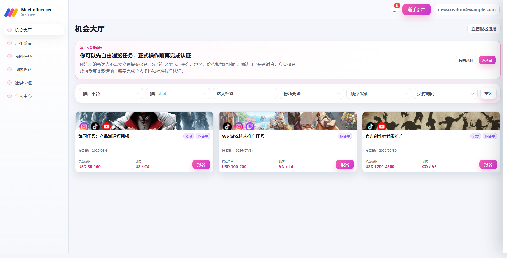
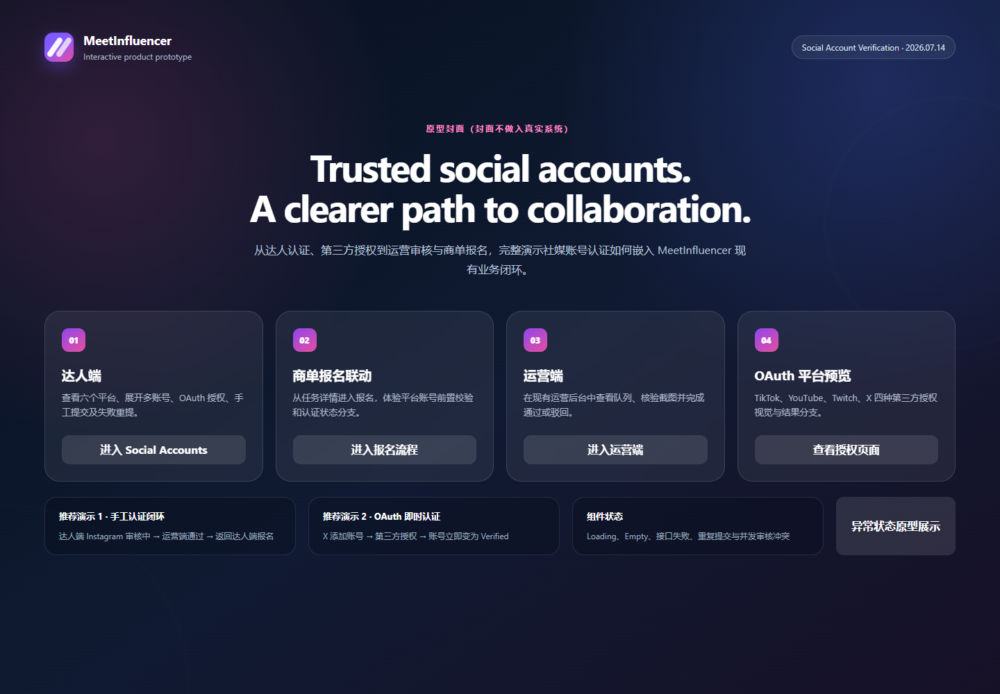

# MeetInfluencer Internship Portfolio

> MeetInfluencer 实习项目作品集（脱敏版）

本仓库以《实习生工作手册》为主线，整理实习期间参与的产品测试、问题跟进、交互原型和需求分析工作。它不是 MeetInfluencer 正式产品源码，也不包含生产环境代码、账号密码、内部地址、真实用户数据或完整内部业务文档。

## 交互 Demo

| Demo | 内容 | 本地入口 |
| --- | --- | --- |
| 达人端中文新手引导 | 资料完善、社媒认证、任务报名、进度跟踪、邀请、产物提交/重提及收益查看 | [`demos/new-user-guide/index.html`](demos/new-user-guide/index.html) |
| 社媒账号认证与数据同步 | 六平台多账号、模拟 OAuth/人工认证、报名资格拦截、运营审核、通知及异常状态 | [`demos/social-account-verification/index.html`](demos/social-account-verification/index.html) |

两个 Demo 均为单文件静态原型，CSS 与 JavaScript 已内嵌；不会连接 MeetInfluencer 服务端，也不会自动发送网络请求。页面状态只保存在内存中，刷新后会重置。





## 主要工作成果

### 产品测试与问题跟进

- 围绕广告主端、达人端及运营审核流程开展功能验证。
- 阶段性整理并跟进 187 条产品问题：P0 49 条、P2 98 条、P3 40 条。
- 重点验证主流程闭环、状态流转、重复操作拦截、驳回重提、权限隔离及错误反馈。
- 原始问题记录含内部上下文，因此仓库只保留脱敏后的测试方法与复盘。

### 达人端中文新手引导

- 将复杂任务拆分为可练习的分步教程。
- 覆盖报名、邀请、内容交付、驳回重提与收益查看等核心场景。
- 使用隔离的演示数据，不影响真实业务系统。

### 社媒账号认证原型

- 梳理账号绑定、认证状态、审核与数据同步范围。
- 覆盖模拟 OAuth、人工截图认证、多账号管理、运营审核及通知。
- 补充异常、冲突、空态及重新认证等恢复路径。

### 英文文案与需求验收

- 检查页面标题、按钮、状态、表单提示和错误文案的一致性。
- 对照产品需求与上线验收标准，梳理三端主流程和异常流程。
- 区分交互原型、需求设计与正式功能实现的范围边界。

## 仓库结构

```text
demos/
  new-user-guide/                 达人端中文新手引导 Demo
  social-account-verification/   社媒账号认证 Demo
docs/
  internship-summary.md          实习工作总结
  testing-and-issue-tracking.md  测试与问题跟进方法
  requirements-overview.md       脱敏后的需求与验收概要
  source-manifest.md             资料来源与处理方式
assets/                          脱敏后的预览图
```

## 本地运行

克隆仓库后，可直接用浏览器打开任一 `index.html`。也可以在仓库根目录启动静态服务器：

```bash
python -m http.server 8000
```

然后访问：

- `http://localhost:8000/demos/new-user-guide/`
- `http://localhost:8000/demos/social-account-verification/`

GitHub 的文件浏览页面不会直接运行 HTML。本仓库保持 Private，且默认不启用公开 GitHub Pages。

## 进一步阅读

- [实习工作总结](docs/internship-summary.md)
- [测试与问题跟进方法](docs/testing-and-issue-tracking.md)
- [需求与验收概要](docs/requirements-overview.md)
- [资料来源与脱敏说明](docs/source-manifest.md)

## 信息安全

- 不提交账号、密码、令牌、Cookie 或私钥。
- 不提交内部 IP、后台入口或仅限组织访问的链接。
- 不提交真实用户、达人、广告主或员工个人信息。
- 不提交未经脱敏的 PDF、CSV、Base 快照或截图。
- Demo 中的姓名、邮箱、账号、时间和审核记录均为示例数据。

详见 [NOTICE.md](NOTICE.md)。
